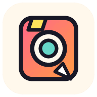
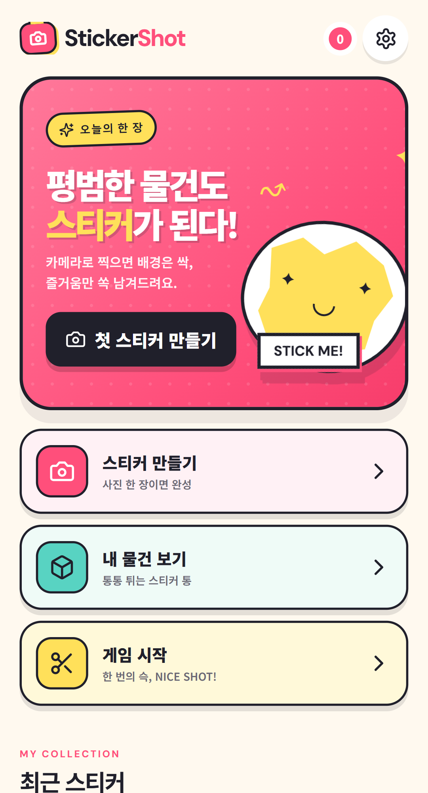
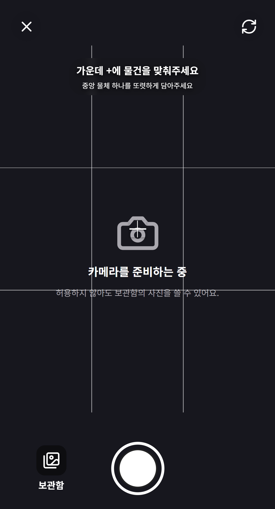
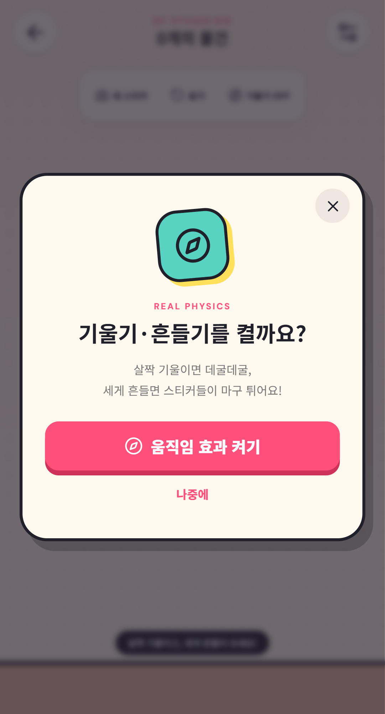
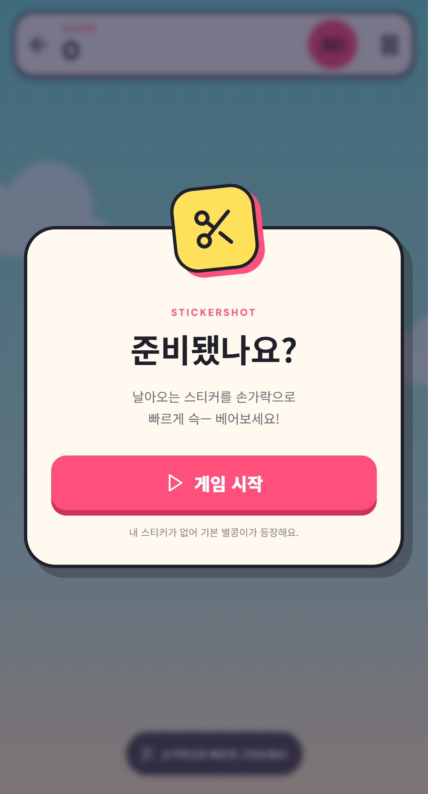

<p align="center">
  
</p>

<h1 align="center">StickerShot 스티커샷</h1>

<p align="center">
  <strong>찍고, 모으고, 베어봐!</strong><br />
  내 주변의 물건을 직접 찍어 스티커로 만들고 가지고 노는 모바일 웹게임
</p>

<p align="center">
  <a href="https://rudwndgus.github.io/StickerShot/"><strong>📱 StickerShot 바로 실행하기</strong></a>
</p>

---

## StickerShot은 어떤 앱인가요?

StickerShot은 휴대폰 카메라로 물건을 찍으면 배경을 지우고, 물건만 남겨 나만의 스티커로 만들어 주는 앱입니다.

만든 스티커는 `내 물건 보기`에서 굴리고 던지거나 휴대폰을 흔들어 가지고 놀 수 있습니다. `게임 시작`에서는 화면을 손가락으로 그어 직접 만든 스티커를 베고 점수와 콤보를 쌓을 수 있습니다.

- 별도 회원가입 없음
- 앱 설치 없이 웹에서 바로 실행
- 촬영한 사진을 서버로 전송하지 않고 내 기기 안에서 처리
- iPhone과 Android의 홈 화면에 앱처럼 설치 가능

> StickerShot은 세로로 들고 사용하는 모바일 화면에 가장 잘 맞습니다.

## 화면 미리보기

<table>
  <tr>
    <td align="center" width="50%">
      <br />
      <strong>홈</strong><br />
      <sub>스티커 만들기, 내 물건 보기, 게임을 한곳에서 시작합니다.</sub>
    </td>
    <td align="center" width="50%">
      <br />
      <strong>카메라 촬영</strong><br />
      <sub>격자 중앙의 +에 스티커로 만들 물건을 맞춥니다.</sub>
    </td>
  </tr>
  <tr>
    <td align="center" width="50%">
      <br />
      <strong>내 물건 보기</strong><br />
      <sub>스티커를 굴리고 던지거나 휴대폰을 흔들어 가지고 놉니다.</sub>
    </td>
    <td align="center" width="50%">
      <br />
      <strong>스티커 베기 게임</strong><br />
      <sub>날아오는 나만의 스티커를 빠르게 그어 베고 콤보를 쌓습니다.</sub>
    </td>
  </tr>
</table>

## 빠르게 시작하기

1. 휴대폰에서 [StickerShot](https://rudwndgus.github.io/StickerShot/)을 엽니다.
2. `첫 스티커 만들기` 또는 `스티커 만들기`를 누릅니다.
3. 카메라 권한을 허용합니다.
4. 화면 가운데 `+`에 만들고 싶은 물건을 맞춰 촬영합니다.
5. 배경이 제거되고 스티커가 사진에서 떼어지는 장면을 기다립니다.
6. 이름과 테두리를 고른 뒤 `스티커 저장`을 누릅니다.

카메라를 사용하기 어렵다면 촬영 화면의 사진 버튼을 눌러 보관함에 있는 사진으로도 만들 수 있습니다.

## 스티커 만드는 방법

### 1. 물건을 가운데에 맞추기

카메라의 격자 중앙에 있는 작은 `+`가 인식 기준점입니다. `+`가 배경이나 손이 아니라 **물건 한가운데**에 오도록 맞춰 주세요.

손바닥 위에 물건을 올려 촬영해도 됩니다. StickerShot은 중앙의 물건을 우선 선택하고 주변의 손 피부 영역은 배경으로 판단하도록 보정합니다.

### 2. 사진 촬영하기

화면 아래의 흰색 촬영 버튼을 누릅니다. 사진이 흔들리지 않도록 촬영 순간에 휴대폰을 잠깐 멈추면 결과가 좋아집니다.

### 3. 배경 제거 기다리기

사진 분석이 끝나면 실제로 분리된 스티커가 원본 사진에서 들려서 떼어집니다. 원본 배경이 사라진 뒤 자동으로 `스티커 완성` 화면으로 이동합니다.

첫 번째 스캔은 이미지 처리 기능을 준비하느라 평소보다 조금 오래 걸릴 수 있습니다.

### 4. 꾸미고 저장하기

- 스티커 이름을 입력합니다.
- `없음`, `얇게`, `기본`, `두껍게` 중 원하는 테두리를 고릅니다.
- `스티커 저장`을 누르면 내 기기에 보관됩니다.
- 결과가 마음에 들지 않으면 `다시 찍기` 또는 `다른 사진`을 선택합니다.

## 누끼가 잘 따지게 촬영하는 팁

- 가운데 `+`를 반드시 물건 위에 놓아 주세요.
- 물건 전체가 사진 안에 들어오도록 약간의 여백을 남겨 주세요.
- 물건과 배경의 색이 서로 다를수록 인식이 잘됩니다.
- 밝고 그림자가 심하지 않은 곳에서 촬영해 주세요.
- 한 화면에 여러 물건을 두기보다 스티커로 만들 물건 하나만 찍어 주세요.
- 투명한 물건, 털처럼 아주 가는 가장자리, 배경과 색이 거의 같은 물건은 분리가 어려울 수 있습니다.
- 손 위에서 촬영할 때도 `+`는 손바닥이 아니라 물건 중앙에 맞춰 주세요.

배경이 너무 많이 남거나 물건 일부가 잘렸다면 다른 각도나 단순한 배경에서 다시 촬영하는 것이 가장 빠릅니다.

## 내 물건 보기

저장한 스티커들이 위에서 쏟아져 내려와 통 바닥에 쌓입니다.

- **잡고 이동하기:** 스티커를 손가락으로 누른 채 움직입니다.
- **던지기:** 스티커를 잡아 빠르게 밀고 손을 뗍니다.
- **자세히 보기:** 스티커를 길게 누르면 이름 변경, 게임 등장 여부 설정, 삭제가 가능합니다.
- **다시 쏟기:** 위쪽의 `쏟기` 버튼을 누르면 스티커가 다시 위에서 내려옵니다.
- **기울이기:** `기울기 OFF`를 눌러 움직임 권한을 허용한 뒤 휴대폰을 살짝 기울여 보세요.
- **세게 흔들기:** 움직임 효과가 켜진 상태에서 휴대폰을 강하게 흔들면 스티커들이 마구 튀고 회전합니다.

일반 기울기에는 최대 중력 제한이 있어 평소 휴대폰을 보는 각도에서는 부드럽게 움직입니다. 강하게 흔들 때만 큰 충격이 적용됩니다.

성능 보호를 위해 물리 화면에는 최근 스티커 최대 22개가 등장합니다. 저장할 수 있는 전체 스티커 개수에는 이 제한이 적용되지 않습니다.

## 게임 즐기기

1. 홈 화면에서 `게임 시작`을 누릅니다.
2. 안내 화면의 시작 버튼을 누릅니다.
3. 아래에서 날아오는 스티커를 손가락으로 빠르게 그어 베어 주세요.
4. 연속으로 베면 콤보가 올라가고 더 높은 점수를 얻습니다.
5. 시간이 끝나면 최종 점수, 최고 콤보, 가장 많이 벤 물건을 확인할 수 있습니다.

스티커를 길게 눌러 상세 화면을 열고 `게임에 등장`을 끄면 해당 스티커는 게임에서 나오지 않습니다.

## 휴대폰에 앱으로 설치하기

설치해도 저장된 스티커는 그대로 유지되며, 전체 화면 앱처럼 빠르게 실행할 수 있습니다.

### iPhone · iPad

1. **Safari**에서 [StickerShot](https://rudwndgus.github.io/StickerShot/)을 엽니다.
2. 아래쪽의 공유 버튼을 누릅니다.
3. `홈 화면에 추가`를 선택합니다.
4. 이름을 확인하고 `추가`를 누릅니다.

### Android

1. **Chrome**에서 [StickerShot](https://rudwndgus.github.io/StickerShot/)을 엽니다.
2. 오른쪽 위 메뉴 `⋮`를 누릅니다.
3. `앱 설치` 또는 `홈 화면에 추가`를 선택합니다.

## 권한 안내

| 권한 | 사용하는 이유 | 허용하지 않았을 때 |
|---|---|---|
| 카메라 | 물건을 바로 촬영하기 위해 사용 | 사진 보관함의 이미지로 만들 수 있습니다. |
| 사진 | 기존 사진을 선택하기 위해 사용 | 카메라 촬영만 사용할 수 있습니다. |
| 동작 및 방향 | 내 물건 통에서 기울기와 흔들기를 감지 | 손가락으로 잡고 던지는 기능은 그대로 사용할 수 있습니다. |

iPhone의 동작 권한은 `내 물건 보기` 화면에서 `기울기 OFF` 버튼을 눌렀을 때 요청됩니다.

## 사진과 스티커는 어디에 저장되나요?

촬영한 사진과 스티커는 외부 서버로 업로드되지 않습니다. 배경 제거도 브라우저 안에서 처리되며, 완성한 스티커는 현재 사용 중인 브라우저의 기기 저장소에 보관됩니다.

다음 작업을 하면 저장한 스티커가 사라질 수 있으므로 주의해 주세요.

- Safari 또는 Chrome의 사이트 데이터 삭제
- 비공개 브라우징 모드 사용 후 창 닫기
- 앱 설정에서 `모든 스티커 삭제` 선택
- 기기나 브라우저 변경

현재는 계정이나 클라우드 동기화 기능이 없으므로 다른 휴대폰으로 스티커가 자동 이전되지는 않습니다.

## 업데이트 방법

새 버전이 준비되면 화면 아래에 업데이트 안내가 나타납니다. `지금 업데이트`를 누르면 최신 버전으로 바뀝니다.

안내가 나타나지 않는데 화면이 예전과 같다면 다음 순서로 확인해 주세요.

1. 설치한 StickerShot을 완전히 종료합니다.
2. Safari 또는 Chrome에서 페이지를 다시 엽니다.
3. 설정 화면의 버전 번호를 확인합니다.

## 문제가 생겼을 때

| 증상 | 확인할 내용 |
|---|---|
| 카메라가 열리지 않아요 | 브라우저 사이트 설정에서 카메라 권한을 허용하거나 사진 보관함 버튼을 사용해 주세요. |
| 물건 대신 배경이 스티커가 돼요 | 가운데 `+`를 물건 중앙에 맞추고 단순한 배경에서 다시 촬영해 주세요. |
| 손바닥까지 같이 남아요 | 물건이 손보다 중앙에 오도록 가까이 촬영하고, 손과 물건 사이의 색 차이가 잘 보이게 해 주세요. |
| 스캔이 오래 걸려요 | 첫 스캔에는 이미지 처리 기능을 준비하는 시간이 필요합니다. 잠시 기다린 뒤에도 멈춰 있으면 페이지를 다시 열어 주세요. |
| 기울여도 움직이지 않아요 | `내 물건 보기`에서 `기울기 OFF`를 누르고 동작 및 방향 접근을 허용해 주세요. |
| 흔들어도 크게 튀지 않아요 | 기울기가 `ON`인지 확인한 뒤 짧고 강하게 흔들어 주세요. |
| 저장한 스티커가 안 보여요 | 스티커를 만들 때 사용한 브라우저와 같은 브라우저인지 확인해 주세요. |
| 새 기능이 보이지 않아요 | 앱을 완전히 종료한 뒤 다시 열고 업데이트 안내에서 `지금 업데이트`를 눌러 주세요. |

## 지원 환경

- iPhone: 최신 Safari 권장
- Android: 최신 Chrome 권장
- 카메라, 설치, 동작 센서는 브라우저와 기기의 정책에 따라 일부 기능이 제한될 수 있습니다.
- PC에서도 페이지를 열 수 있지만 카메라 조준, 기울기, 흔들기 기능은 휴대폰에서 가장 자연스럽습니다.

---

<details>
<summary><strong>개발 및 로컬 실행 안내</strong></summary>

Node.js 20 이상을 권장합니다.

```bash
npm install
npm run dev
```

검사와 프로덕션 빌드:

```bash
npm run lint
npm run test
npm run build
npm run preview
```

StickerShot은 React, TypeScript, Vite, OpenCV.js, Matter.js, IndexedDB와 PWA 서비스 워커를 사용합니다. 카메라와 PWA 기능은 `localhost` 또는 HTTPS 환경에서 실행해야 합니다.

</details>

<p align="center">
  <strong>StickerShot · Snap it. Sticker it. Slice it.</strong>
</p>
